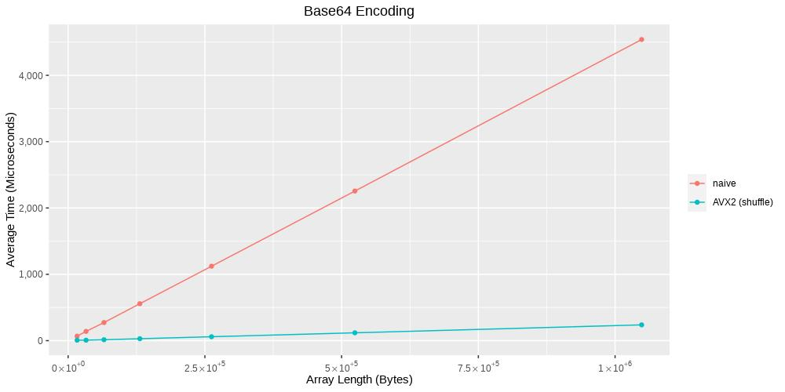
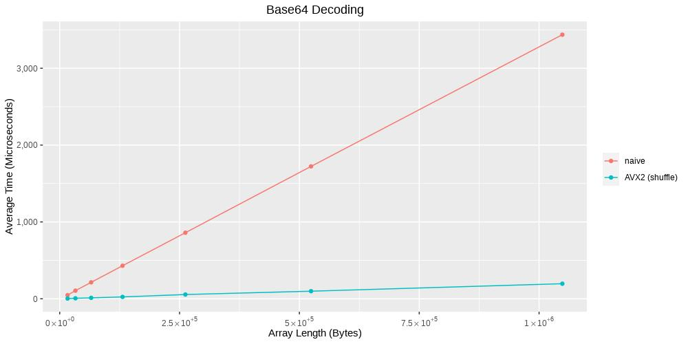
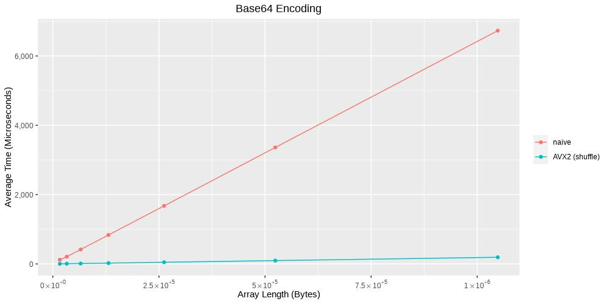
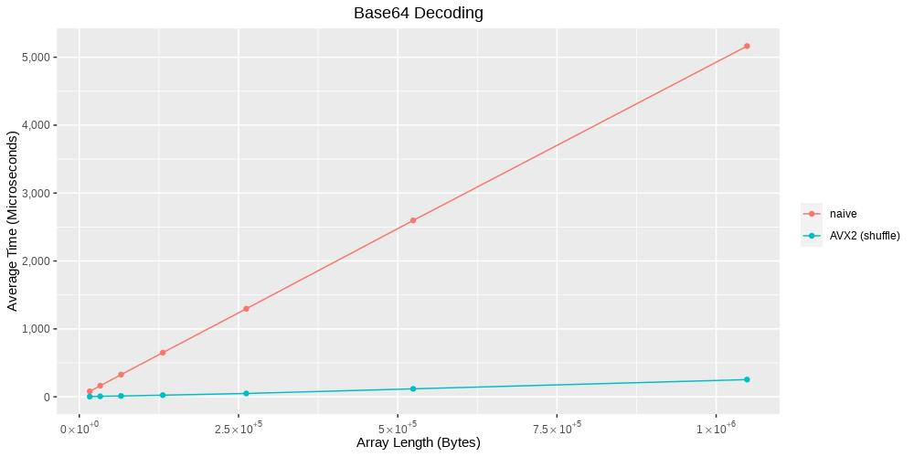
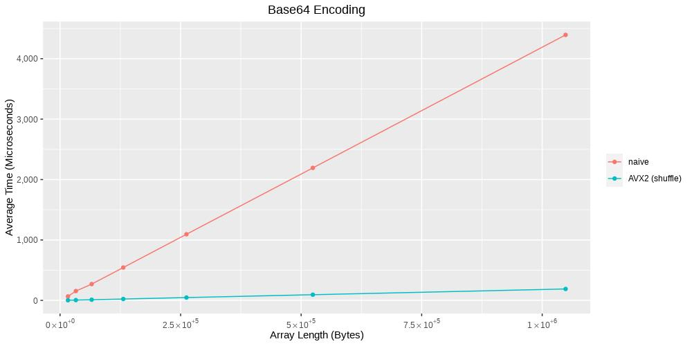
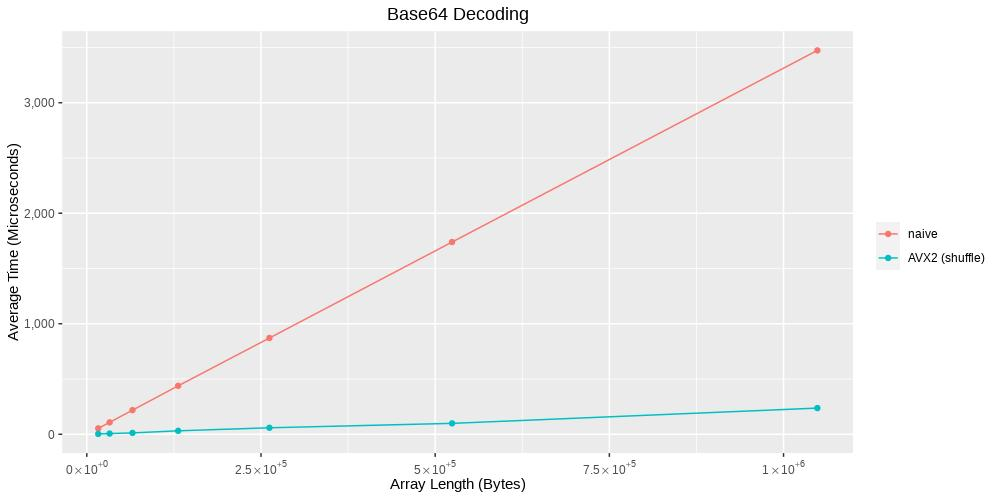
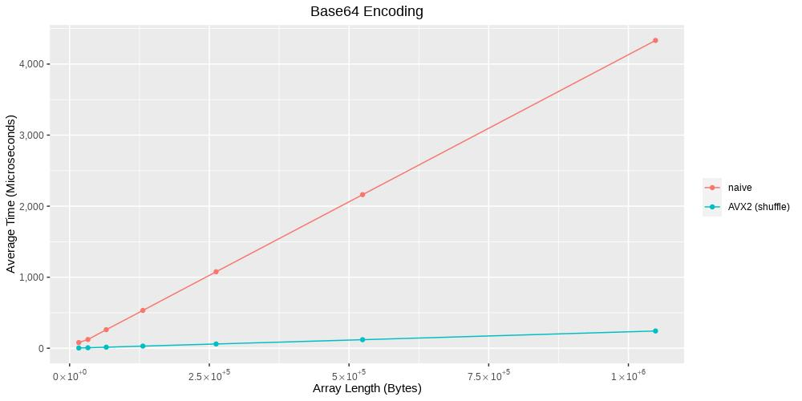
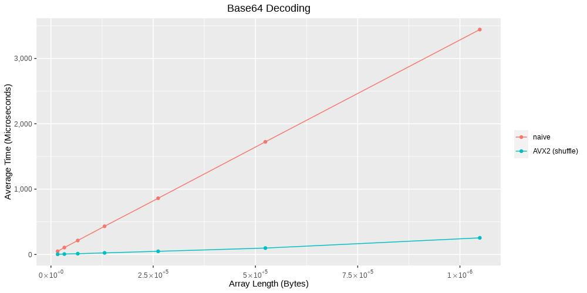
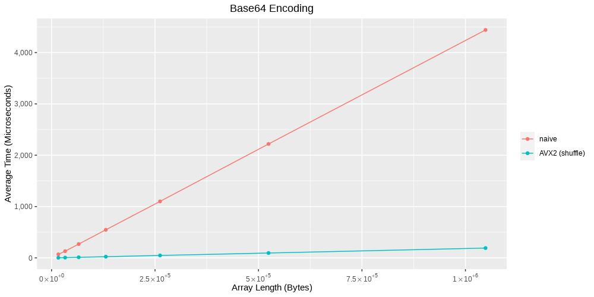
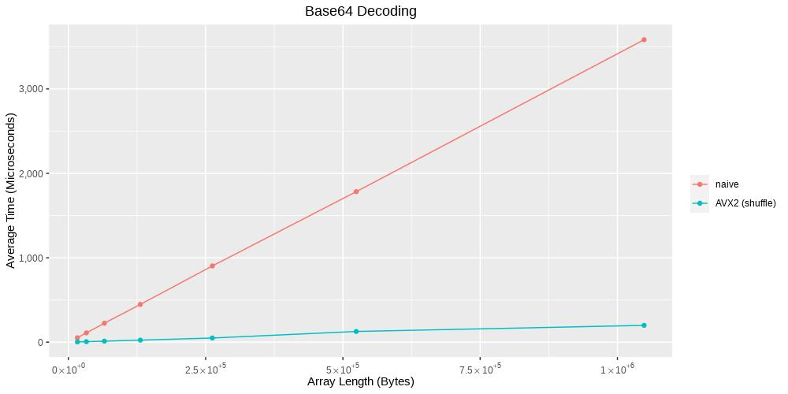

# Puzzle: Base64 Encoding/Decoding

## Goal

Perform Base64 encoding/decoding of an unaligned array of bytes.

## Solutions

### Naive

Idea: Simple for-loop without any optimizations. Let the auto vectorizer of the compiler do his job for the user.

### AVX2

#### Shuffle Bytes (shuffle)

Idea: Put multiple base64 encoded/decoded values into a single 32 byte register and perform multiple encodings/decodings in parallel.

##### Encoding

Read 32 bytes of data and process only 24 bytes (= 2 x 4 triplets of data).

1. Load data from unaligned memory into a 256-bit register.

    ```
    __m256i raw = _mm256_lddqu_si256((__m256i const *)(src + i));
    ```

2. Reorder and shuffle data to get 4 triplets (= 4 x 3 bytes) on each half of a 256-bit register.

    ```
    // reorder
    __m256i t0 = _mm256_permutevar8x32_epi32(raw, _mm256_set_epi32(0, 5, 4, 3, 3, 2, 1, 0));

    // shuffle
    __m256i t1 = _mm256_shuffle_epi8(t0, _mm256_set_epi8(0, 0, 0, 0, 11, 10, 9, 8, 7, 6, 5, 4, 3, 2, 1, 0,
                                                         0, 0, 0, 0, 11, 10, 9, 8, 7, 6, 5, 4, 3, 2, 1, 0));
    ```

3. Shuffle again data to perform character transformation in step 4.

    ```
    // reorder triplets again to perform character transformation
    //
    // bits:      [255.........................................128|127...........................................0]
    // int32:     [32........0|32........0|32........0|32........0|32........0|32........0|32........0|32........0]
    // reordered: [B3|B2|B1|B1|B3|B2|B1|B1|B3|B2|B1|B1|B3|B2|B1|B1|B3|B2|B1|B1|B3|B2|B1|B1|B3|B2|B1|B1|B3|B2|B1|B1]
    //
    __m256i t5 = _mm256_shuffle_epi8(t4, _mm256_set_epi8(11, 10, 9, 9,   8, 7, 6, 6,   5, 4, 3, 3,   2, 1, 0, 0,
                                                         11, 10, 9, 9,   8, 7, 6, 6,   5, 4, 3, 3,   2, 1, 0, 0));
    ```

4. Map bytes from 3 x 8-bits to 4 x 6-bits:

    ```
    //
    // mapping of bytes to characters:
    //
    // bytes: |---3--||---2--||---1--|
    // bits : 765432107654321076543210
    // bits :                 543210
    // char :                 |--1-|
    // bits :         3210          54
    // char :         -2-|          |-
    // bits : 10          5432
    // char : -|          |--3
    // bits :   543210
    // char :   |--4-|
    //

    // get char #1 ; result on byte position #1 of an int32
    __m256i t6 = _mm256_and_si256(t5, _mm256_set1_epi32(0x000000fc));
    t6 = _mm256_srl_epi32(t6, _mm_set_epi32(0, 0, 0, 2));

    // get char #2 ; result on byte position #2 of an int32
    __m256i t7 = _mm256_and_si256(t5, _mm256_set1_epi32(0x00f00300));
    t7 = _mm256_shuffle_epi8(t7, _mm256_set_epi8(12, 13, 14, 12,   8, 9, 10, 8,   4, 5, 6, 4,   0, 1, 2, 0,
                                                 12, 13, 14, 12,   8, 9, 10, 8,   4, 5, 6, 4,   0, 1, 2, 0));
    t7 = _mm256_srl_epi32(t7, _mm_set_epi32(0, 0, 0, 4));

    // get char #3 ; result on byte position #3 of an int32
    __m256i t8 = _mm256_and_si256(t5, _mm256_set1_epi32(0xc00f0000));
    t8 = _mm256_shuffle_epi8(t8, _mm256_set_epi8(14, 15, 12, 12,   10, 11, 8, 8,   6, 7, 4, 4,   2, 3, 0, 0,
                                                 14, 15, 12, 12,   10, 11, 8, 8,   6, 7, 4, 4,   2, 3, 0, 0));
    t8 = _mm256_srl_epi32(t8, _mm_set_epi32(0, 0, 0, 6));

    // get char #4 ; result on byte position #4 of an int32
    __m256i t9 = _mm256_and_si256(t5, _mm256_set1_epi32(0x3f000000));
    ```

5. Add offsets to map characters 1-4 into final representation.

##### Decoding

The decoding is performed in the opposite way the encoding is performed.

## Comparisons

Used compilers:

* GCC 9.3.1
* Clang 10.0.0

### AMD Ryzen 7

System:

* CPU: AMD Ryzen 7 3700X 8-Core Processor
* Memory: DDR4-3600MHz CL16-19-19-39
* OS: openSUSE Leap 15.1

#### Overview

#### Optimization Level O1

GCC 9.3.1:

[](./images/to_base64.AMD_Ryzen_7_3700X_8-Core_Processor.gcc-O1_all.jpg)
[](./images/from_base64.AMD_Ryzen_7_3700X_8-Core_Processor.gcc-O1_all.jpg)

Clang 10.0.0:

[](./images/to_base64.AMD_Ryzen_7_3700X_8-Core_Processor.clang-O1_all.jpg)
[](./images/from_base64.AMD_Ryzen_7_3700X_8-Core_Processor.clang-O1_all.jpg)

#### Optimization Level O2

GCC 9.3.1:

[](./images/to_base64.AMD_Ryzen_7_3700X_8-Core_Processor.gcc-O2_all.jpg)
[](./images/from_base64.AMD_Ryzen_7_3700X_8-Core_Processor.gcc-O2_all.jpg)

Clang 10.0.0:

[](./images/to_base64.AMD_Ryzen_7_3700X_8-Core_Processor.clang-O2_all.jpg)
[](./images/from_base64.AMD_Ryzen_7_3700X_8-Core_Processor.clang-O2_all.jpg)

#### Optimization Level O3

GCC 9.3.1:

[](./images/to_base64.AMD_Ryzen_7_3700X_8-Core_Processor.gcc-O3_all.jpg)
[](./images/from_base64.AMD_Ryzen_7_3700X_8-Core_Processor.gcc-O3_all.jpg)

Clang 10.0.0:

[](./images/to_base64.AMD_Ryzen_7_3700X_8-Core_Processor.clang-O3_all.jpg)
[](./images/from_base64.AMD_Ryzen_7_3700X_8-Core_Processor.clang-O3_all.jpg)
