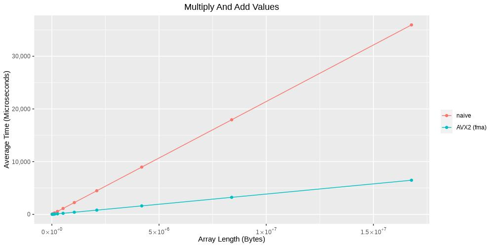
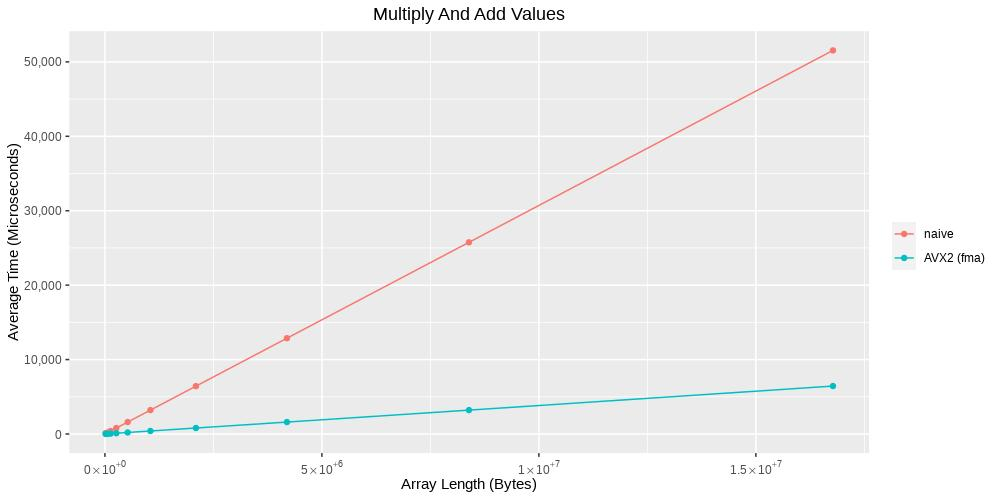
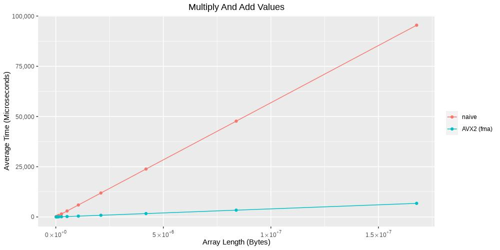
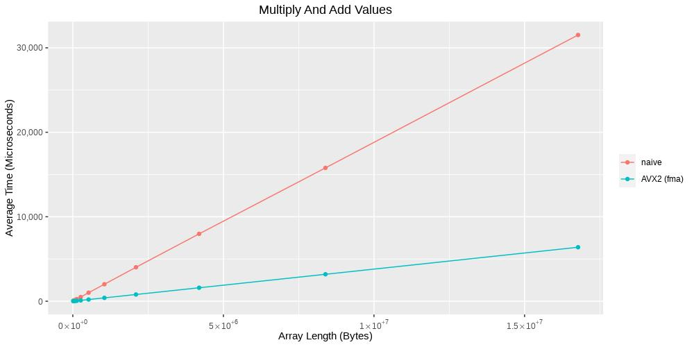
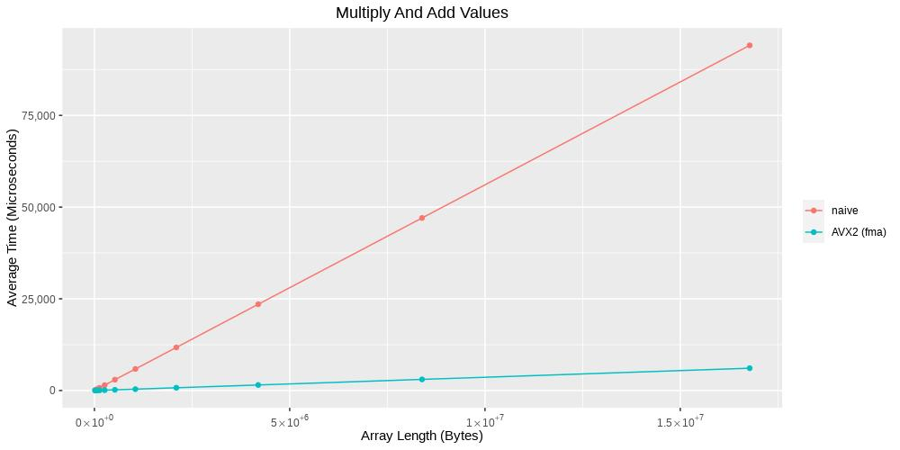
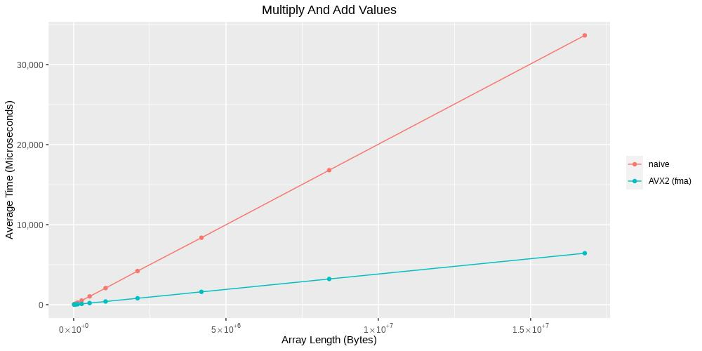

# Puzzle: Scale Bytes

## Goal

An unaligned array of unsigned bytes is given. Each value of the array should be multiplied by a factor and incremented by an offset. Saturation should be performed if values lower 0 or greater than 255.

## Solutions

### Naive

Idea: Iterate over the array and just multiply the factor and add the offset to each of the values. The auto vectorizer of the compiler will do the optimization for the user.

### AVX2

#### Fused Multiply Add (fma)

Idea: Try to use the [_mm256_fmadd_pd](https://software.intel.com/sites/landingpage/IntrinsicsGuide/#text=_mm256_fmadd_pd&expand=2541) intrinsic to perform multiplication and addition at once.

For this solution only AVX/AVX2 intrinsics are used.

1. Load data from unaligned memory into a 256-bit register.

    ```
    __m256i raw = _mm256_lddqu_si256((__m256i const *)(src + i));
    ```

2. Split 256-bit data into two 128-bit parts.

    ```
    const __m128i raw_lo = _mm256_extracti128_si256(raw, 0);
    const __m128i raw_hi = _mm256_extracti128_si256(raw, 1);
    ```

3. For each 128-bit part we have to:

    1. Convert 8-bit unsigned to 16-bit unsigned integers.

        ```
        const __m256i conv16 = _mm256_cvtepu8_epi16(data);
        ```

    2. Split converted 256-bit data into two 128-bit parts.

    2. Convert 16-bit unsigned integers from 128-bit registers to 64-bit doubles.

        ```
        // extract lower part
        const __m128i conv16_lo = _mm256_extracti128_si256(conv16, 0);

        // convert 16- to 32-bit unsigned integers
        const __m256i conv32_lo = _mm256_cvtepi16_epi32(conv16_lo);

        // split 256-bit converted data again into two 128-bit parts
        const __m128i conv32_lolo = _mm256_extracti128_si256(conv32_lo, 0);
        const __m128i conv32_lohi = _mm256_extracti128_si256(conv32_lo, 1);

        // convert 32-bit unsigned integers into double precision real numbers
        const __m256d real_lolo = _mm256_cvtepi32_pd(conv32_lolo);
        const __m256d real_lohi = _mm256_cvtepi32_pd(conv32_lohi);
        ```

    4. Perform the Fused-Multiply-Add (FMA) operation.

        ```
        const __m256d fma_lolo = _mm256_fmadd_pd(real_lolo, factors, offsets);
        const __m256d fma_lohi = _mm256_fmadd_pd(real_lohi, factors, offsets);
        ```

    5. Convert the double values to 32-bit integer values.

        ```
        const __m128i res_lolo = _mm256_cvtpd_epi32(fma_lolo);
        const __m128i res_lohi = _mm256_cvtpd_epi32(fma_lohi);
        ```

    6. Saturate result (values has to be in the range [0..255]).

        ```
        const __m256i saturated_lo = _mm256_min_epu32(_mm256_max_epu32(res_lo, _mm256_setzero_si256()), _mm256_set1_epi32(255));
        ```

    7. Shuffle bytes from 32-bit representation to 8-bit (saturated) representation.

    This has to be performed for both 128-bit parts of the 256-bit register.

## Comparisons

Used compilers:

* GCC 9.3.1
* Clang 10.0.0

### AMD Ryzen 7

System:

* CPU: AMD Ryzen 7 3700X 8-Core Processor
* Memory: DDR4-3600MHz CL16-19-19-39
* OS: openSUSE Leap 15.1

#### Overview

#### Optimization Level O1

GCC 9.3.1:

[](./images/scale.AMD_Ryzen_7_3700X_8-Core_Processor.gcc-O1_all.jpg)

Clang 10.0.0:

[](./images/scale.AMD_Ryzen_7_3700X_8-Core_Processor.clang-O1_all.jpg)

#### Optimization Level O2

GCC 9.3.1:

[](./images/scale.AMD_Ryzen_7_3700X_8-Core_Processor.gcc-O2_all.jpg)

Clang 10.0.0:

[](./images/scale.AMD_Ryzen_7_3700X_8-Core_Processor.clang-O2_all.jpg)

#### Optimization Level O3

GCC 9.3.1:

[](./images/scale.AMD_Ryzen_7_3700X_8-Core_Processor.gcc-O3_all.jpg)

Clang 10.0.0:

[](./images/scale.AMD_Ryzen_7_3700X_8-Core_Processor.clang-O3_all.jpg)
