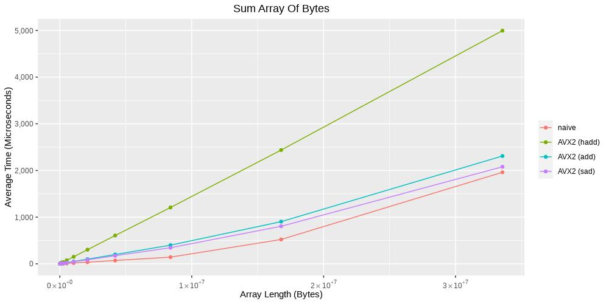

# Puzzle: Sum Bytes

## Goal

An unaligned array with a size of multiple of 32 bytes is given. Accumulate these values and return a 32-bit value as a result.

## Solutions

### Naive

Idea: Iterate over the array and just sum up the values. The auto vectorizer of the compiler will do the optimization for the user.

Naive for-loop used to accumulate the values.

### AVX2

#### Horizontal Additions (hadd)

Idea: Try to use the [_mm256_hadd_epi32](https://software.intel.com/sites/landingpage/IntrinsicsGuide/#text=_mm256_hadd_epi32&expand=453,4913,4995,453,2939,3401,1890,2946,2939,2941,1618,2940,94,1618,5155,5155,5152,3557,4902,3557,3557,3557,3557,3557,3557,3557,5603,3557,5652,5655,94,4946,5655,3418,5596,4920,5596,5596,453,3747,3633,3747,5596,5595,2426,3828,5655,94,97,94,1618,2941,4854,97,2429,2941,4854,5021,4854,539,4854,1618,5152,1618,2941,2941) intrinsic to perform horizontal additions of adjacent pairs of 32-bit integers.

For this solution a mix of AVX/AVX2 and SSE intrinsics are used.

The process is roughly as follows:

1. Load data from unaligned memory into a 256-bit register.

    ```
    __m256i raw = _mm256_loadu_si256((__m256i const *)(data + i));
    ```

2. Extract two 128-bit's from the 256-bit register.

    ```
    __m128i raw_high = _mm256_extracti128_si256(raw, 1);
    __m128i raw_low  = _mm256_extracti128_si256(raw, 0);
    ```

3. For each 128-bit part of the loaded 256-bit register do:

    1. Convert lower and upper half of the 128-bit register from 8-bit values to 32-bit values.

        ```
        // convert lower part
        __m256i converted_low = _mm256_cvtepu8_epi32(data);

        // convert upper part
        __m128i data_shuffled = _mm_shuffle_epi8(data, shuffle_mask);
        __m256i converted_high = _mm256_cvtepu8_epi32(data_shuffled);
        ```

    2. Perform the horizontal addition two times.

        ```
        __m256i tmp1_hadd = _mm256_hadd_epi32(converted_high, converted_high);
        __m256i tmp2_hadd = _mm256_hadd_epi32(tmp1_hadd, tmp1_hadd);
        ```

    3. Extract two 128-bit's from the 256-bit temporary register.

        ```
        __m128i tmp2_hadd_high = _mm256_extracti128_si256(tmp2_hadd, 1);
        __m128i tmp2_hadd_low  = _mm256_extracti128_si256(tmp2_hadd, 0);
        ```
    
    4. Perform an ordinary addition on the two 128-bit values to build a partial sum.

        ```
        __m128i part_sum_high = _mm_add_epi32(tmp2_hadd_high, tmp2_hadd_low);
        ```

    5. Perform step 3.2. until 3.4. for the converted lower part.

4. Add the partial sums, calculated at step 3.

5. Increment sum counter.

#### (Vertical) Additions (add)

Idea: Try to use the [_mm256_add_epi16](https://software.intel.com/sites/landingpage/IntrinsicsGuide/#expand=453,4913,4995,453,3401,1890,2946,2939,1618,2940,94,1618,5155,5155,5152,3557,4902,3557,3557,3557,3557,3557,3557,3557,5603,3557,5652,5655,94,4946,5655,3418,5596,4920,5596,5596,453,3747,3633,3747,5596,5595,2426,3828,5655,94,97,94,1618,4854,97,2429,2941,4854,5021,4854,539,4854,1618,5152,1618,2941,2941,1532,1618,3344,3344,2457,3170,1618,97,97,1618,3418,3296,3418,1618,1618,2438,97,2438,1618,1618,3418,1547,1615,1618,3418,3170,3418,3170,3295,1618,3296,3295,1618,3296,3343,3295,300,1618,3295,1618,3295,3418,3295,2983,1618,1609,3295,3344,3418,2433,97,1618,3546,1618,5516,5510,5023,301,97,2941,2939,2941,5153,88&techs=SSE2,SSE3,SSSE3,AVX,AVX2&text=_mm256_add_epi16) intrinsic to perform normal 32-bit register additions.

For this solution only AVX/AVX2 intrinsics are used.

The process is roughly as follows:

1. Load data from unaligned memory into a 256-bit register.

    ```
    __m256i raw = _mm256_loadu_si256((__m256i const *)(data + i));
    ```

2. Convert 8-bit values to 16-bit values in place.

    1. Clear every 2nd bytes.

        ```
        __m256i t0 = _mm256_and_si256(raw, and16_mask);
        ```

    2. Shift loaded data as 16-bit values to the right.

        ```
        __m256i t1 = _mm256_srli_epi16(raw, 8);
        ```

    3. Accumulate the 16-bit values.

        ```
        accu = _mm256_add_epi16(zero, t0);
        accu = _mm256_add_epi16(accu, t1);
        ```

3. Convert the 16-bit values to 32-bit values in place.

    Like the steps in the previous section, with the difference shifting and using 32-bit values instead of 16-bit values.

4. Increment sum counter.

#### Absolute Difference + Horizontal Sum (sad)

Idea: Try to use the [_mm256_sad_epu8](https://software.intel.com/sites/landingpage/IntrinsicsGuide/#expand=453,4913,4995,453,3401,1890,2946,2939,1618,2940,94,1618,5155,5155,5152,3557,4902,3557,3557,3557,3557,3557,3557,3557,5603,3557,5652,5655,94,4946,5655,5596,4920,5596,5596,453,3747,3633,3747,5596,5595,2426,3828,5655,94,97,94,1618,97,2429,2941,5021,4854,539,4854,1618,5152,1618,2941,2941,1532,1618,3344,3344,2457,3170,1618,97,97,1618,3418,3418,1618,1618,2438,97,2438,1618,1618,3418,1547,1615,1618,3418,3170,3418,3170,3295,1618,3296,3295,1618,3296,3343,3295,300,1618,3295,1618,3295,3418,3295,2983,1618,1609,3295,3344,3418,2433,97,1618,3546,1618,5516,5510,5023,301,97,2941,2939,2941,5153,88,3296,3418,4854,4854&techs=SSE2,SSE3,SSSE3,AVX,AVX2&text=_mm256_sad_epu8) intrinsic that performs absolute differences and sum them horizontally together.

For this solution only AVX/AVX2 intrinsics are used.

The process is roughly as follows:

1. Load data from unaligned memory into a 256-bit register.

    ```
    __m256i raw = _mm256_loadu_si256((__m256i const *)(data + i));
    ```

2. Compute the absolute differences

    ```
    __m256i tmp = _mm256_sad_epu8(raw, zeros);
    ```

3. Increment sum counter.

That's all!

## Comparisons

Used compilers:

* GCC 9.3.1
* Clang 10.0.0

### AMD Ryzen 7

System:

* CPU: AMD Ryzen 7 3700X 8-Core Processor
* Memory: DDR4-3600MHz CL16-19-19-39
* OS: openSUSE Leap 15.1

#### Overview

#### Optimization Level O1

GCC 9.3.1:

[](./images/sum.AMD_Ryzen_7_3700X_8-Core_Processor.gcc-O1_all.jpg)

Clang 10.0.0:

[](./images/sum.AMD_Ryzen_7_3700X_8-Core_Processor.clang-O1_all.jpg)

#### Optimization Level O2

GCC 9.3.1:

[](./images/sum.AMD_Ryzen_7_3700X_8-Core_Processor.gcc-O2_all.jpg)

Clang 10.0.0:

[](./images/sum.AMD_Ryzen_7_3700X_8-Core_Processor.clang-O2_all.jpg)

#### Optimization Level O3

GCC 9.3.1:

[](./images/sum.AMD_Ryzen_7_3700X_8-Core_Processor.gcc-O3_all.jpg)

Clang 10.0.0:

[](./images/sum.AMD_Ryzen_7_3700X_8-Core_Processor.clang-O3_all.jpg)
